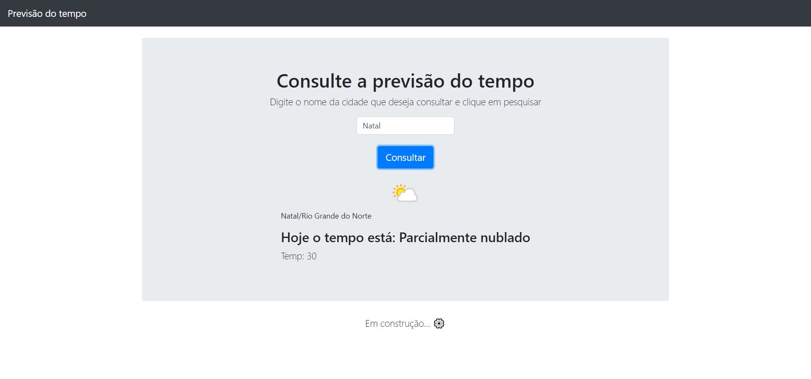

# Projeto: Consulta do tempo

### O Projeto consiste em uma aplicação simples que faz o consumo de um API chamada API WEATHER, onde o usuário indica uma localização e dessa forma consegue informações sobre o tempo.

> Prévia do Projeto:

🔗 [Clique aqui para acessar!](https://dabliuene.github.io/consulta-tempo/)

## 🧰 Tecnologias

- HTML
- CSS
- Javascript
- React
- API WEATHER
- Git e Github

## 💡 Contato

walsonathan@gmail.com
